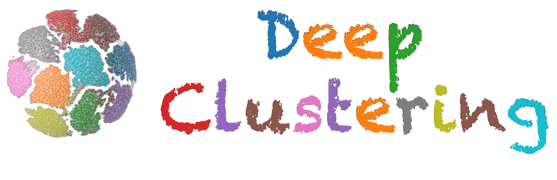

     

<!-- 
<h1 align="center">
    
Deep Clustering: methods and implements

</h1> -->

### 
**[2024.08] Our [survey paper](https://arxiv.org/abs/2206.07579) has been accepted by ACM Computing Surveys! We are also preparing a new benchmark codebase, providing implementations of classic methods and easy-to-use APIs for developing your own deep clustering methods!** 

**[2022.06]We have released a new [survey paper](https://arxiv.org/abs/2206.07579) based on this repository, with a new perspective of existing deep clustering methods! We are looking forward to any comments or discussions on this topic :)** 

### Data type specific deep clustering: We also provide some interesting data type specific deep clustering:
* [Deep Graph Clustering](./graphclustering/README.md)

### Paper List
|    Survey Paper    |  Conference  |
|  :---------  | :------:  |
| :triangular_flag_on_post: [**A Comprehensive Survey on Deep Clustering: Taxonomy, Challenges, and Future Directions**](https://arxiv.org/abs/2206.07579) | ACM Computing Surveys |
| [Deep Clustering: A Comprehensive Survey](https://arxiv.org/pdf/2210.04142.pdf) | arXiv 2022 |
| [A Survey of Clustering With Deep Learning: From the Perspective of Network Architecture](https://ieeexplore.ieee.org/stamp/stamp.jsp?arnumber=8412085) | IEEE ACCESS 2018  |
| [Clustering with Deep Learning: Taxonomy and New Methods](https://arxiv.org/pdf/1801.07648.pdf) | arXiv 2018 |
| [Unsupervised clustering for deep learning: A tutorial survey](http://acta.uni-obuda.hu/Karoly_Fuller_Galambos_87.pdf) | APH 2018 |

|    Pre-print Paper    |  Method  |  Conference  |  Code |
|  :---------  | :------:  | :------: | :------: |
| [C3: Cross-instance guided Contrastive Clustering](https://arxiv.org/pdf/2211.07136.pdf) | C3 | Arxiv 2022 | [Pytorch](https://github.com/Armanfard-Lab/C3) |
| [Learning Statistical Representation with Joint Deep Embedded Clustering](https://arxiv.org/pdf/2109.05232.pdf) | StatDEC | arXiv 2021 | - |
| [Cluster Analysis with Deep Embeddings and Contrastive Learning](https://arxiv.org/pdf/2109.12714.pdf) | - | arXiv 2021 | - |
| [Deep Clustering with Self-supervision using Pairwise Data Similarities](https://www.techrxiv.org/articles/preprint/Deep_Clustering_with_Self-supervision_using_Pairwise_Data_Similarities/14852652) | DCSS | TechRxiv 2021 | [Pytorch](https://github.com/Armanfard-Lab/DCSS/blob/main/Codes/train.py) |
| [Deep clustering by semantic contrastive learning](https://arxiv.org/pdf/2103.02662.pdf) | SCL | arXiv 2021 | - |
| [Doubly contrastive deep clustering](https://arxiv.org/pdf/2103.05484.pdf) | DCDC | arXiv 2021 | [Pytorch](https://github.com/ZhiyuanDang/DCDC) |
| [DHOG: Deep Hierarchical Object Grouping](https://arxiv.org/pdf/2003.08821.pdf) | DHOG | arXiv 2020 | - |
| [Deep Robust Clustering by Contrastive Learning](https://arxiv.org/abs/2008.03030) | DRC | arXiv 2020 | - |
| [Un-Mix: Rethinking Image Mixture for Unsupervised Visual Representation Learning](https://arxiv.org/pdf/2003.05438.pdf) | Un-Mix | arXiv 2020 | [Pytorch](https://github.com/szq0214/Un-Mix) |
| [Differentiable Deep Clustering with Cluster Size Constraints](https://arxiv.org/pdf/1910.09036.pdf) |  -  | arXiv 2019 | - |
| [Deep Continuous Clustering](https://arxiv.org/pdf/1803.01449.pdf) |  DCC  | arXiv 2018 | [Pytorch](https://github.com/shahsohil/DCC) |
| [Clustering-driven Deep Embedding with Pairwise Constraints](https://arxiv.org/pdf/1803.08457.pdf) |  CPAC  | arXiv 2018 |  [Pytorch](https://github.com/sharonFogel/CPAC) |
| [Deep Temporal Clustering : Fully Unsupervised Learning of Time-Domain Features](https://arxiv.org/abs/1802.01059) | DTC | arXiv 2018 | [Keras](https://github.com/FlorentF9/DeepTemporalClustering) |
| [Deep Unsupervised Clustering using Mixture of Autoencoders](https://arxiv.org/pdf/1712.07788.pdf) | MIXAE | arXiv 2017 | - |
| [Discriminatively Boosted Image Clustering with Fully Convolutional Auto-Encoders](https://arxiv.org/pdf/1703.07980.pdf) | DBC | arXiv 2017 | - |
| [Deep Clustering Network](https://arxiv.org/pdf/1610.04794v1.pdf) |  DCN  | arXiv 2016 | [Theano](https://github.com/boyangumn/DCN-New) |

|    Paper    |  Method |  Conference |  Code |
|  :---------  | :------:  | :------: | :------: |
| [Efficient Constrained K-center Clustering with Background Knowledge](https://ojs.aaai.org/index.php/AAAI/article/view/30058) | ML-CL-k-Center | AAAI 2024 | [Pytorch](https://github.com/ChaoqiJia/ML-CL-k-Center) |
| [SEC: More Accurate Clustering Algorithm via Structural Entropy](https://ojs.aaai.org/index.php/AAAI/article/view/29152) | - | AAAI 2024 | - |
| [Enhancing Ensemble Clustering with Adaptive High-Order Topological Weights](https://ojs.aaai.org/index.php/AAAI/article/view/29552) | AWEC | AAAI 2024 | [Pytorch](https://github.com/ltyong/awec) |
| [Upper Bounding Barlow Twins: A Novel Filter for Multi-Relational Clustering](https://ojs.aaai.org/index.php/AAAI/article/view/29383) | BTGF | AAAI 2024 | [Pytorch](https://github.com/XweiQ/BTGF) |
| [Decoupled Contrastive Multi-View Clustering with High-Order Random Walks](https://ojs.aaai.org/index.php/AAAI/article/view/29330) | DIVIDE | AAAI 2024 | [Pytorch](https://github.com/XLearning-SCU/2024-AAAI-DIVIDE) |
| [Low-Distortion Clustering with Ordinal and Limited Cardinal Information](https://ojs.aaai.org/index.php/AAAI/article/view/28811) | - | AAAI 2024 | - |
| [Double-Bounded Optimal Transport for Advanced Clustering and Classification](https://ojs.aaai.org/index.php/AAAI/article/view/29419) | DB-OT | AAAI 2024 | - |
| [Partial Multi-View Clustering via Self-Supervised Network](https://ojs.aaai.org/index.php/AAAI/article/view/29086) | PVC-SSN | AAAI 2024 | - |
| [DVSAI: Diverse View-Shared Anchors Based Incomplete Multi-View Clustering](https://ojs.aaai.org/index.php/AAAI/article/view/29595) | DVSAI | AAAI 2024 | - |
| [Embedded Feature Selection on Graph-Based Multi-View Clustering](https://ojs.aaai.org/index.php/AAAI/article/view/29645) | EFSGMC | AAAI 2024 | - |
| [Incomplete Contrastive Multi-View Clustering with High-Confidence Guiding](https://ojs.aaai.org/index.php/AAAI/article/view/29000) | ICMVC | AAAI 2024 | [Pytorch](https://github.com/liunian-Jay/ICMVC) |
| [Deep Variational Incomplete Multi-View Clustering: Exploring Shared Clustering Structures](https://ojs.aaai.org/index.php/AAAI/article/view/29548) | - | AAAI 2024 | - |
| [Towards a Theoretical Understanding of Why Local Search Works for Clustering with Fair-Center Representation](https://ojs.aaai.org/index.php/AAAI/article/view/29638) | - | AAAI 2024 | - |
| [Live and Learn: Continual Action Clustering with Incremental Views](https://ojs.aaai.org/index.php/AAAI/article/view/29561) | CAC | AAAI 2024 | - |
| [Learning Cluster-Wise Anchors for Multi-View Clustering](https://ojs.aaai.org/index.php/AAAI/article/view/29609) | CAMVC | AAAI 2024 | - |
| [Multi-Level Cross-Modal Alignment for Image Clustering](https://ojs.aaai.org/index.php/AAAI/article/view/29387) | - | AAAI 2024 | - |
| [Cross-Domain Contrastive Learning for Time Series Clustering](https://ojs.aaai.org/index.php/AAAI/article/view/28740) | CDCC | AAAI 2024 | [Pytorch](https://github.com/JiacLuo/CDCC) |
| [RPSC: Robust Pseudo-Labeling for Semantic Clustering](https://ojs.aaai.org/index.php/AAAI/article/view/29309) | RPSC | AAAI 2024 | - |
| [Low-Rank Kernel Tensor Learning for Incomplete Multi-View Clustering](https://ojs.aaai.org/index.php/AAAI/article/view/29526) | LRKT-IMVC | AAAI 2024 | - |
| [SURER: Structure-Adaptive Unified Graph Neural Network for Multi-View Clustering](https://ojs.aaai.org/index.php/AAAI/article/view/29478) | SURER | AAAI 2024 | - |
| [A Non-parametric Graph Clustering Framework for Multi-View Data](https://ojs.aaai.org/index.php/AAAI/article/view/29594) | NpGC | AAAI 2024 | - |
| [An Optimal Transport View for Subspace Clustering and Spectral Clustering](https://ojs.aaai.org/index.php/AAAI/article/view/29563) | SFGWH | AAAI 2024 | - |
| [Discriminatively Fuzzy Multi-View K-means Clustering with Local Structure Preserving](https://ojs.aaai.org/index.php/AAAI/article/view/29585) | DFMKLS | AAAI 2024 | - |
| [Adaptive Feature Imputation with Latent Graph for Deep Incomplete Multi-View Clustering](https://ojs.aaai.org/index.php/AAAI/article/view/29380) | AGDIMC | AAAI 2024 | - |
| [Sample-Level Cross-View Similarity Learning for Incomplete Multi-View Clustering](https://ojs.aaai.org/index.php/AAAI/article/view/29310) | SCSL | AAAI 2024 | [Pytorch](https://github.com/Tracesource/SCSL) |
| [Inducing Clusters Deep Kernel Gaussian Process for Longitudinal Data](https://ojs.aaai.org/index.php/AAAI/article/view/29279) | ICDKGP | AAAI 2024 | [Pytorch](https://github.com/junjieliang672/ICDKGP) |
| [Hard Regularization to Prevent Deep Online Clustering Collapse without Data Augmentation](https://ojs.aaai.org/index.php/AAAI/article/view/29340) | - | AAAI 2024 | [Pytorch](https://github.com/Lou1sM/online_hard_clustering) |
| [EDISON: Enhanced Dictionary-Induced Tensorized Incomplete Multi-View Clustering with Gaussian Error Rank Minimization](https://openreview.net/pdf?id=fiugPLSXjK) | EDISON | ICML 2024 | - |
| [Diffusion-based Missing-view Generation With the Application on Incomplete Multi-view Clustering](https://openreview.net/pdf?id=OHFxcU9jwW) | DMVG | ICML 2024 | [Pytorch](https://github.com/ckghostwj/DMVG/tree/main) |
| [Adversarially Robust Deep Multi-View Clustering: A Novel Attack and Defense Framework](https://openreview.net/pdf?id=D9EfAkQCzh) | AR-DMVC | ICML 2024 | [To be released](https://github.com/libertyhhn/AR-DMVC) |
| [Interpretable Deep Clustering for Tabular Data](https://openreview.net/pdf?id=QPy7zLfvof) | IDC | ICML 2024 | [To be released](https://github.com/jsvir/idc) |
| [Multi-View Clustering by Inter-cluster Connectivity Guided Reward](https://openreview.net/pdf?id=uEx2bSAJu8) | - | ICML 2024 | - |
| [Image Clustering with External Guidance](https://openreview.net/pdf?id=JSYN891WnB) | TAC | ICML 2024 | [Pytotrch](https://github.com/XLearning-SCU/2024-ICML-TAC) |
| [Towards Resource-friendly, Extensible and Stable Incomplete Multi-view Clustering](https://openreview.net/pdf?id=O45u81aby2) | ToRES | ICML 2024 | - |
| [Image Clustering via the Principle of Rate Reduction in the Age of Pretrained Models](https://openreview.net/pdf?id=ptCIlV24YZ) | CCP | ICLR 2024 | [Pytorch](https://github.com/LeslieTrue/CPP) |
| [P2OT: Progressive Partial Optimal Transport for Deep Imbalanced Clustering](https://openreview.net/pdf?id=hD3sGVqPsr) | P2OT | ICLR 2024 | [Pytorch](https://github.com/rhfeiyang/PPOT) |
| [Deep Generative Clustering with Multimodal Diffusion Variational Autoencoders](https://openreview.net/pdf?id=k5THrhXDV3) | CMVAE | ICLR 2024 | [To be released](https://github.com/epalu/CMVAE) |
| [Image Clustering Conditioned on Text Criteria](https://openreview.net/pdf?id=G2cG3mQqop) |  IC\|TC  | ICLR 2024 | [Pytorch](https://github.com/sehyunkwon/ICTC) |
| [Differentiable Information Bottleneck for Deterministic Multi-view Clustering](https://openaccess.thecvf.com/content/CVPR2024/papers/Yan_Differentiable_Information_Bottleneck_for_Deterministic_Multi-view_Clustering_CVPR_2024_paper.pdf) | DIB |CVPR 2024| - |
| [Investigating and Mitigating the Side Effects of Noisy Views for Self-Supervised Clustering Algorithms in Practical Multi-View Scenarios](https://openaccess.thecvf.com/content/CVPR2024/papers/Xu_Investigating_and_Mitigating_the_Side_Effects_of_Noisy_Views_for_CVPR_2024_paper.pdf)| MVCAN|CVPR 2024| [Pytorch](https://github.com/SubmissionsIn/MVCAN)|
| [Learn from View Correlation: An Anchor Enhancement Strategy for Multi-view Clustering](https://openaccess.thecvf.com/content/CVPR2024/papers/Liu_Learn_from_View_Correlation_An_Anchor_Enhancement_Strategy_for_Multi-view_CVPR_2024_paper.pdf) | AEVC | CVPR 2024| |
| [A Clustering Framework for Unsupervised and Semi-supervised New Intent Discovery](https://ieeexplore.ieee.org/document/10349963) | USNID | IEEE TKDE 2023 | [Pytorch](https://github.com/thuiar/TEXTOIR/tree/main/open_intent_discovery) |
| [Deep Multiview Clustering by Contrasting Cluster Assignments](https://openaccess.thecvf.com/content/ICCV2023/html/Chen_Deep_Multiview_Clustering_by_Contrasting_Cluster_Assignments_ICCV_2023_paper.html) | CVCL | ICCV 2023 | [Pytorch](https://github.com/chenjie20/CVCL) |
| [Stable Cluster Discrimination for Deep Clustering](https://openaccess.thecvf.com/content/ICCV2023/html/Qian_Stable_Cluster_Discrimination_for_Deep_Clustering_ICCV_2023_paper.html) | SeCu | ICCV 2023 | - |
| [Cross-view Topology Based Consistent and Complementary Information for Deep Multi-view Clustering](https://openaccess.thecvf.com/content/ICCV2023/html/Dong_Cross-view_Topology_Based_Consistent_and_Complementary_Information_for_Deep_Multi-view_ICCV_2023_paper.html) | CTCC | ICCV 2023 | - |
| [Deep Multi-view Subspace Clustering with Anchor Graph](https://www.ijcai.org/proceedings/2023/398) | DMCAG | IJCAI 2023 | - |
| [Incomplete Multi-view Clustering via Prototype-based Imputation](https://www.ijcai.org/proceedings/2023/435) | ProImp | IJCAI 2023 | - |
| [Dual Mutual Information Constraints for Discriminative Clustering](https://ojs.aaai.org/index.php/AAAI/article/view/26032) | DMICC | AAAI 2023 | [Pytorch](https://github.com/Li-Hyn/DMICC) |
| [Self-Supervised Graph Attention Networks for Deep Weighted Multi-View Clustering](https://ojs.aaai.org/index.php/AAAI/article/view/25960) | SGDMC | AAAI 2023 | - |
| [Semantic-Enhanced Image Clustering](https://ojs.aaai.org/index.php/AAAI/article/view/25841) | SIC | AAAI 2023 | - |
| [Highly Confident Local Structure Based Consensus Graph Learning for Incomplete Multi-View Clustering](https://openaccess.thecvf.com/content/CVPR2023/html/Wen_Highly_Confident_Local_Structure_Based_Consensus_Graph_Learning_for_Incomplete_CVPR_2023_paper.html) | HCLS_CGL | CVPR 2023 | - |
| [Deep Incomplete Multi-view Clustering with Cross-view Partial Sample and Prototype Alignment](https://arxiv.org/pdf/2303.15689.pdf) | IMVC | CVPR 2023 | - |
| [On the Effects of Self-supervision and Contrastive Alignment in Deep Multi-view Clustering](https://arxiv.org/pdf/2303.09877.pdf)| DeepMVC | CVPR 2023 | [Pytorch](https://github.com/DanielTrosten/DeepMVC) |
| [DivClust: Controlling Diversity in Deep Clustering](https://arxiv.org/pdf/2304.01042.pdf) | DivClust | CVPR 2023 | [Pytorch](https://github.com/ManiadisG/DivClust) |
| [SPICE: Semantic Pseudo-labeling for Image Clustering](https://arxiv.org/pdf/2103.09382v1.pdf) | SPICE | TIP 2022 | [Pytorch](https://github.com/niuchuangnn/SPICE) |
| [Generalised Mutual Information for Discriminative Clustering](https://arxiv.org/pdf/2210.06300.pdf) | GEMINI | NeurIPS 2022 | - |
| [Learning Representation for Clustering via Prototype Scattering and Positive Sampling](https://arxiv.org/pdf/2111.11821.pdf) | ProPos | TPAMI 2022 | [Pytorch](https://github.com/Hzzone/ProPos) |
| [Dual Contrastive Prediction for Incomplete Multi-view Representation Learning](http://pengxi.me/wp-content/uploads/2022/08/DCP.pdf) | DCP | TPAMI 2022 | [Pytorch](https://github.com/XLearning-SCU/2022-TPAMI-DCP) |
| [GOCA: Guided Online Cluster Assignment for Self-supervised Video Representation Learning](https://link.springer.com/chapter/10.1007/978-3-031-19821-2_1) | GOCA | ECCV 2022 | [Pytorch](https://github.com/Seleucia/goca) |
| [Fine-Grained Fashion Representation Learning by Online Deep Clustering](https://assets.amazon.science/35/21/586873644828bb72c11308479667/fine-grained-fashion-representation-learning-by-online-deep-clustering.pdf) | MODC | ECCV 2022 | - |
| [Embedding Contrastive Unsupervised Features to Cluster In- and Out-of-distribution Noise in Corrupted Image Datasets](https://arxiv.org/pdf/2207.01573.pdf) | SNCF | ECCV 2022 | [Pytorch](https://github.com/PaulAlbert31/SNCF) |  
| [On Mitigating Hard Clusters for Face Clustering](https://arxiv.org/pdf/2207.11895.pdf) | - | ECCV 2022 | [Pytorch](https://github.com/echoanran/On-Mitigating-Hard-Clusters) |
| [Deep Safe Incomplete Multi-view Clustering: Theorem and Algorithm](https://proceedings.mlr.press/v162/tang22c/tang22c.pdf) | DSIMVC | ICML 2022 | [Pytorch](https://github.com/Gasteinh/DSIMVC) |
| [Locally Normalized Soft Contrastive Clustering for Compact Clusters](https://web.archive.org/web/20220717202429id_/https://www.ijcai.org/proceedings/2022/0457.pdf) | LNSCC | IJCAI 2022 | - |
| [Contrastive Multi-view Hyperbolic Hierarchical Clustering](https://arxiv.org/pdf/2205.02618.pdf) | CMHHC | IJCAI 2022 | - |
| [Efficient Orthogonal Multi-view Subspace Clustering](https://dl.acm.org/doi/pdf/10.1145/3534678.3539282) | OMSC | KDD 2022 | [MATLAB](https://github.com/ManshengChen/Code-for-OMSC-master) |
| [Clustering with Fair-Center Representation: Parameterized Approximation Algorithms and Heuristics](https://dl.acm.org/doi/pdf/10.1145/3534678.3539487) | - | KDD 2022 | - |
| [DeepDPM: Deep Clustering With an Unknown Number of Clusters](https://openaccess.thecvf.com/content/CVPR2022/papers/Ronen_DeepDPM_Deep_Clustering_With_an_Unknown_Number_of_Clusters_CVPR_2022_paper.pdf) | DeepDPM | CVPR 2022 | [Pytorch](https://github.com/BGU-CS-VIL/DeepDPM) |
| [Unsupervised Action Segmentation by Joint Representation Learning and Online Clustering](https://openaccess.thecvf.com/content/CVPR2022/papers/Kumar_Unsupervised_Action_Segmentation_by_Joint_Representation_Learning_and_Online_Clustering_CVPR_2022_paper.pdf) | - | CVPR 2022 | - |
| [Efficient Deep Embedded Subspace Clustering](https://openaccess.thecvf.com/content/CVPR2022/papers/Cai_Efficient_Deep_Embedded_Subspace_Clustering_CVPR_2022_paper.pdf) | EDESC | CVPR 2022 | [Pytorch](https://github.com/JinyuCai95/EDESC-pytorch) |
| [SLIC: Self-Supervised Learning With Iterative Clustering for Human Action Videos](https://openaccess.thecvf.com/content/CVPR2022/papers/Khorasgani_SLIC_Self-Supervised_Learning_With_Iterative_Clustering_for_Human_Action_Videos_CVPR_2022_paper.pdf) | SLIC | CVPR 2022 | [Pytorch](https://github.com/rvl-lab-utoronto/video_similarity_search) |
| [MPC: Multi-View Probabilistic Clustering](https://openaccess.thecvf.com/content/CVPR2022/papers/Liu_MPC_Multi-View_Probabilistic_Clustering_CVPR_2022_paper.pdf) | MPC | CVPR 2022 | - |
| [Deep Safe Multi-View Clustering: Reducing the Risk of Clustering Performance Degradation Caused by View Increase](https://openaccess.thecvf.com/content/CVPR2022/papers/Tang_Deep_Safe_Multi-View_Clustering_Reducing_the_Risk_of_Clustering_Performance_CVPR_2022_paper.pdf) | DSMVC | CVPR 2022 | - |
| [Discriminative Similarity for Data Clustering](https://openreview.net/pdf?id=kj0_45Y4r9i) | CDS | ICLR 2022 | - |
| [A Deep Variational Approach to Clustering Survival Data](https://openreview.net/pdf?id=RQ428ZptQfU) | VaDeSC | ICLR 2022 | [TensorFlow](https://github.com/i6092467/vadesc) |
| [Contrastive Fine-grained Class Clustering via Generative Adversarial Networks](https://openreview.net/pdf?id=XWODe7ZLn8f) | C3-GAN | ICLR 2022 | [Pytorch](https://github.com/naver-ai/c3-gan) |
| [Deep Clustering of Text Representations for Supervision-Free Probing of Syntax](https://www.aaai.org/AAAI22Papers/AAAI-7788.GuptaA.pdf) | SyntDEC | AAAI 2022 | - |
| [Top-Down Deep Clustering with Multi-generator GANs](https://arxiv.org/pdf/2112.03398.pdf) | HC-MGAN | AAAI 2022 | [Pytorch](https://github.com/dmdmello/HC-MGAN) |
| [Neural generative model for clustering by separating particularity and commonality](https://www.sciencedirect.com/science/article/pii/S0020025521012585) | DGC | Information Sciences 2022 | - |
| [Information Maximization Clustering via Multi-View Self-Labelling](https://www.sciencedirect.com/science/article/pii/S095070512200510X) | IMC-SwAV | Knowledge-Based Systems 2022 | [Pytorch](https://github.com/foiv0s/imc-swav-pub) |
| [Sign prediction in sparse social networks using clustering and collaborative filtering](https://link.springer.com/content/pdf/10.1007/s11227-021-03902-5.pdf) | - | TJSC 2022 | - |
| [You Never Cluster Alone](https://arxiv.org/abs/2106.01908) | TCC | NeurIPS 2021 | - |
| [Multi-Facet Clustering Variational Autoencoders](https://arxiv.org/pdf/2106.05241.pdf) | MFCVAE | NeurIPS 2021 | [Pytorch](https://github.com/FabianFalck/mfcvae) |
| [One-pass Multi-view Clustering for Large-scale Data](https://openaccess.thecvf.com/content/ICCV2021/papers/Liu_One-Pass_Multi-View_Clustering_for_Large-Scale_Data_ICCV_2021_paper.pdf) | OPMC | ICCV 2021 | [Matlab](https://github.com/liujiyuan13/OPMC-code_release) |
| [Multi-VAE: Learning Disentangled View-common and View-peculiar Visual Representations for Multi-view Clustering](https://openaccess.thecvf.com/content/ICCV2021/papers/Xu_Multi-VAE_Learning_Disentangled_View-Common_and_View-Peculiar_Visual_Representations_for_Multi-View_ICCV_2021_paper.pdf) | Multi-VAE | ICCV 2021 | [Pytorch](https://github.com/SubmissionsIn/Multi-VAE) |
| [Learn to Cluster Faces via Pairwise Classification](https://openaccess.thecvf.com/content/ICCV2021/papers/Liu_Learn_To_Cluster_Faces_via_Pairwise_Classification_ICCV_2021_paper.pdf) | - | ICCV 2021 | - |
| [Multimodal Clustering Networks for Self-supervised Learning from Unlabeled Videos](https://arxiv.org/pdf/2104.12671.pdf) | MCN | ICCV 2021 | [Pytorch](https://github.com/brian7685/Multimodal-Clustering-Network) |
| [Clustering by Maximizing Mutual Information Across Views](https://arxiv.org/abs/2107.11635) | CRLC | ICCV 2021 | - |
| [End-to-End Robust Joint Unsupervised Image Alignment and Clustering](https://openaccess.thecvf.com/content/ICCV2021/papers/Zeng_End-to-End_Robust_Joint_Unsupervised_Image_Alignment_and_Clustering_ICCV_2021_paper.pdf) | Jim-Net | ICCV 2021| - |
| [Learning Hierarchical Graph Neural Networks for Image Clustering](https://openaccess.thecvf.com/content/ICCV2021/papers/Xing_Learning_Hierarchical_Graph_Neural_Networks_for_Image_Clustering_ICCV_2021_paper.pdf) | Hi-LANDER | ICCV 2021 | [Pytorch](https://github.com/dmlc/dgl/tree/master/examples/pytorch/hilander) |
| [Deep Descriptive Clustering](https://arxiv.org/pdf/2105.11549.pdf) | DDC | IJCAI 2021 | - |
| [Details (Don't) Matter: Isolating Cluster Information in Deep Embedded Spaces](https://www.ijcai.org/proceedings/2021/0389.pdf) | ACe/DeC | IJCAI 2021 | - |
| [Graph Debiased Contrastive Learning with Joint Representation Clustering](https://www.ijcai.org/proceedings/2021/0473.pdf) | GDCL | IJCAI 2021 | [Pytorch](https://github.com/hzhao98/GDCL) |
| [Unsupervised Feature Learning by Cross-Level Instance-Group Discrimination](http://people.eecs.berkeley.edu/~xdwang/papers/CLD.pdf) | CLD | CVPR 2021 | [Pytorch](https://github.com/frank-xwang/CLD-UnsupervisedLearning) |
| [Nearest Neighbor Matching for Deep Clustering](https://openaccess.thecvf.com/content/CVPR2021/html/Dang_Nearest_Neighbor_Matching_for_Deep_Clustering_CVPR_2021_paper.html) | NNM | CVPR 2021 | [Pytorch](https://github.com/ZhiyuanDang/NNM) |
| [Jigsaw Clustering for Unsupervised Visual Representation Learning](https://openaccess.thecvf.com/content/CVPR2021/html/Chen_Jigsaw_Clustering_for_Unsupervised_Visual_Representation_Learning_CVPR_2021_paper.html) | JigsawClustering | CVPR 2021 | [Pytorch](https://github.com/dvlab-research/JigsawClustering) |
| [COMPLETER: Incomplete Multi-view Clustering via Contrastive Prediction](https://openaccess.thecvf.com/content/CVPR2021/html/Lin_COMPLETER_Incomplete_Multi-View_Clustering_via_Contrastive_Prediction_CVPR_2021_paper.html) | COMPLETER | CVPR 2021 | [Pytorch](https://github.com/XLearning-SCU/2021-CVPR-Completer) |
| [Reconsidering Representation Alignment for Multi-view Clustering](https://openaccess.thecvf.com/content/CVPR2021/html/Trosten_Reconsidering_Representation_Alignment_for_Multi-View_Clustering_CVPR_2021_paper.html) | SiMVC & CoMVC | CVPR 2021 | [Pytorch](https://github.com/DanielTrosten/mvc) |
| [Double Low-rank Representation with Projection Distance Penalty for Clustering](https://github.com/fuzhiqiang1230/DLRRPD/blob/main/8382_Double_low_rank_representation_with_projection_distance_penalty_for_clustering.pdf) | DLRRPD | CVPR 2021 | [Matlab](https://github.com/fuzhiqiang1230/DLRRPD) |
| [Improving Unsupervised Image Clustering With Robust Learning](https://arxiv.org/pdf/2012.11150.pdf) | RUC | CVPR 2021 | [Pytorch](https://github.com/deu30303/RUC) |
| [Learning a Self-Expressive Network for Subspace Clustering](https://openaccess.thecvf.com/content/CVPR2021/html/Zhang_Learning_a_Self-Expressive_Network_for_Subspace_Clustering_CVPR_2021_paper.html) | SENet | CVPR 2021 | [Pytorch](https://github.com/zhangsz1998/self-expressive-network) |
| [Clusformer: A Transformer Based Clustering Approach to Unsupervised Large-Scale Face and Visual Landmark Recognition](https://openaccess.thecvf.com/content/CVPR2021/papers/Nguyen_Clusformer_A_Transformer_Based_Clustering_Approach_to_Unsupervised_Large-Scale_Face_CVPR_2021_paper.pdf) | Clusformer | CVPR 2021 | - |
| [Cluster-wise Hierarchical Generative Model for Deep Amortized Clustering](https://openaccess.thecvf.com/content/CVPR2021/html/Liu_Cluster-Wise_Hierarchical_Generative_Model_for_Deep_Amortized_Clustering_CVPR_2021_paper.html) | CHiGac | CVPR 2021 | - |
| [Refining Pseudo Labels with Clustering Consensus over Generations for Unsupervised Object Re-identification](https://openaccess.thecvf.com/content/CVPR2021/html/Zhang_Refining_Pseudo_Labels_With_Clustering_Consensus_Over_Generations_for_Unsupervised_CVPR_2021_paper.html) | RLCC | CVPR 2021 | - |
| [Clustering-friendly Representation Learning via Instance Discrimination and Feature Decorrelation](https://openreview.net/pdf?id=e12NDM7wkEY) | IDFD | ICLR 2021 | [Pytorch](https://github.com/TTN-YKK/Clustering_friendly_representation_learning) |
| [MiCE: Mixture of Contrastive Experts for Unsupervised Image Clustering](https://openreview.net/pdf?id=gV3wdEOGy_V) | MiCE | ICLR 2021 | [Pytorch](https://github.com/TsungWeiTsai/MiCE) |
| [Discovering New Intents with Deep Aligned Clustering](https://arxiv.org/pdf/2012.08987.pdf) | DeepAligned | AAAI 2021 | [Pytorch](https://github.com/thuiar/TEXTOIR/tree/main/open_intent_discovery) |
| [Contrastive Clustering](https://arxiv.org/pdf/2009.09687.pdf) | CC | AAAI 2021 | [Pytorch](https://github.com/Yunfan-Li/Contrastive-Clustering) |
| [LRSC: Learning Representations for Subspace Clustering](https://www.aaai.org/AAAI21Papers/AAAI-2600.LiC.pdf) | LRSC | AAAI 2021 | - |
| [Deep Fusion Clustering Network](https://arxiv.org/pdf/2012.09600.pdf) | DFCN | AAAI 2021 | [Pytorch](https://github.com/WxTu/DFCN) |
| [Variational Deep Embedding Clustering by Augmented Mutual Information Maximization](https://ieeexplore.ieee.org/abstract/document/9412996) | VCAMI | ICPR 2021 | - |
| [Supporting Clustering with Contrastive Learning](https://arxiv.org/pdf/2103.12953.pdf) | SCCL | NAACL 2021 | [Pytorch](https://github.com/amazon-research/sccl) |
| [Pseudo-Supervised Deep Subspace Clustering](https://ieeexplore.ieee.org/stamp/stamp.jsp?tp=&arnumber=9440402) | PSSC | TIP 2021 | [TensorFlow](https://github.com/sckangz/SelfsupervisedSC) |
| [A hybrid approach for text document clustering using Jaya optimization algorithm](https://www.sciencedirect.com/science/article/pii/S0957417421004814) |  HJO-DC | ESWA 2021 | - |
| [Deep video action clustering via spatio-temporal feature learning](https://www.sciencedirect.com/science/article/pii/S0925231221001946) | DVAC | Neurocomputing 2021 | - |
| [A new clustering method for the diagnosis of CoVID19 using medical images](https://link.springer.com/article/10.1007/s10489-020-02122-3) | IGSA | Applied Intelligence 2021 | - |
| [A Decoder-Free Variational Deep Embedding for Unsupervised Clustering](https://ieeexplore.ieee.org/abstract/document/9410431) | DFVC | TNNLS 2021 | - |
| [Image clustering using an augmented generative adversarial network and information maximization](https://arxiv.org/pdf/2011.04094.pdf) | - | TNNLS 2021 | [TensorFlow](https://github.com/foiv0s/rim-dcgan) |
| [Learning the Precise Feature for Cluster Assignment](https://arxiv.org/pdf/2106.06159.pdf) | - | IEEE Trans Cybern 2021 | [TensorFlow](https://github.com/gyh5421/unified_deep_clustering) |
| [Deep Subspace Clustering with Data Augmentation](https://proceedings.neurips.cc/paper/2020/hash/753a043674f0193523abc1bbce678686-Abstract.html) | DSCwithDA | NeurIPS 2020 | [Pytorch](https://github.com/mahdiabavisani/DSCwithDA) |
| [Deep Transformation-Invariant Clustering](https://arxiv.org/abs/2006.11132) | DTI | NeurIPS 2020 | [Pytorch](https://github.com/monniert/dti-clustering) |
| [Unsupervised Learning of Visual Features by Contrasting Cluster Assignments](https://arxiv.org/pdf/2006.09882.pdf)| SwAV | NeurIPS 2020 | [Pytorch](https://github.com/facebookresearch/swav) |
| [Adversarial Learning for Robust Deep Clustering](https://proceedings.neurips.cc/paper/2020/hash/6740526b78c0b230e41ae61d8ca07cf5-Abstract.html) | ALRDC | NeurIPS 2020 | [Keras](https://github.com/xdxuyang/ALRDC) |
| [Self-supervised learning by cross-modal audio-video clustering](https://proceedings.neurips.cc/paper/2020/file/6f2268bd1d3d3ebaabb04d6b5d099425-Paper.pdf) | XDC | NeurIPS 2020 | [Pytorch](https://github.com/HumamAlwassel/XDC) |
| [Mitigating Embedding and Class Assignment Mismatch in Unsupervised Image Classification](https://www.ecva.net/papers/eccv_2020/papers_ECCV/papers/123690749.pdf) | TSUC | ECCV 2020 | [Pytorch](https://github.com/dscig/TwoStageUC) |
| [GATCluster: Self-Supervised Gaussian-Attention Network for Image Clustering](https://arxiv.org/pdf/2002.11863.pdf) | GATCluster | ECCV 2020 | [Pytorch](https://github.com/niuchuangnn/GATCluster) |
| [Deep Image Clustering with Category-Style Representation](https://www.ecva.net/papers/eccv_2020/papers_ECCV/papers/123590052.pdf) | DCCS | ECCV 2020 | [Pytorch](https://github.com/sKamiJ/DCCS) |
| [MPCC: Matching Priors and Conditionals for Clustering](https://www.ecva.net/papers/eccv_2020/papers_ECCV/papers/123680647.pdf) | MPCC | ECCV 2020 | [Pytorch](https://github.com/jumpynitro/MPCC) |
| [SCAN: Learning to Classify Images without Labels](https://arxiv.org/abs/2005.12320) | SCAN | ECCV 2020 | [Pytorch](https://github.com/wvangansbeke/Unsupervised-Classification) |
| [Learning to Cluster under Domain Shift](https://arxiv.org/abs/2008.04646) | ACIDS | ECCV 2020 | [Pytorch](https://github.com/willi-menapace/acids-clustering-domain-shift) |
| [Multi-View Attribute Graph Convolution Networks for Clustering](https://www.ijcai.org/proceedings/2020/0411.pdf) | MAGCN | IJCAI 2020 | - |
| [CDIMC-net: Cognitive Deep Incomplete Multi-view Clustering Network](https://www.ijcai.org/Proceedings/2020/0447.pdf) | CDIMC-net | IJCAI 2020 | - |
| [Variational Clustering: Leveraging Variational Autoencoders for Image Clustering](https://arxiv.org/pdf/2005.04613) | - | IJCNN 2020 | - |
| [Improving k-Means Clustering Performance with Disentangled Internal Representations](https://arxiv.org/abs/2006.04535) | Annealing SNNL |  IJCNN 2020 | [Pytorch](https://github.com/afagarap/pt-clustering-ae/) |
| [Unsupervised clustering through gaussian mixture variational autoencoder with non-reparameterized variational inference and std annealing](https://netman.aiops.org/wp-content/uploads/2020/08/PID6423661.pdf) | NVISA | IJCNN 2020 | - |
| [Learning to Cluster Faces via Confidence and Connectivity Estimation](https://openaccess.thecvf.com/content_CVPR_2020/papers/Yang_Learning_to_Cluster_Faces_via_Confidence_and_Connectivity_Estimation_CVPR_2020_paper.pdf)| LTC v2 | CVPR 2020 | [Pytorch](https://github.com/yl-1993/learn-to-cluster)|
| [Density-Aware Feature Embedding for Face Clustering](https://openaccess.thecvf.com/content_CVPR_2020/papers/Guo_Density-Aware_Feature_Embedding_for_Face_Clustering_CVPR_2020_paper.pdf)|DA-Net |CVPR 2020|-|
| [Deep Semantic Clustering by Partition Confidence Maximisation](https://raymond-sci.github.io/assets/project/huang2020pica/paper.pdf) | PICA | CVPR 2020 | [Pytorch](https://github.com/Raymond-sci/PICA) |
| [Online Deep Clustering for Unsupervised Representation Learning](https://arxiv.org/abs/2006.10645v1) | ODC | CVPR 2020 | [Pytorch](https://github.com/open-mmlab/OpenSelfSup) |
| [Multi-Scale Fusion Subspace Clustering Using Similarity Constraint](https://openaccess.thecvf.com/content_CVPR_2020/papers/Dang_Multi-Scale_Fusion_Subspace_Clustering_Using_Similarity_Constraint_CVPR_2020_paper.pdf) | SC-MSFSC | CVPR 2020 | - |
| [Unsupervised Clustering using Pseudo-semi-supervised Learning](https://openreview.net/pdf?id=rJlnxkSYPS) | Kingdra | ICLR 2020 | [Keras](https://github.com/divamgupta/deep-clustering-kingdra) |
| [Self-labelling via Simultaneous Clustering and Representation Learning](https://arxiv.org/pdf/1911.05371.pdf)  | SeLa |ICLR 2020| [Pytorch](https://github.com/yukimasano/self-label)|
| [Structural Deep Clustering Network](https://arxiv.org/abs/2002.01633) | SDCN | WWW 2020 | [Pytorch](https://github.com/461054993/SDCN) |
| [Discovering New Intents via Constrained Deep Adaptive Clustering with Cluster Refinement](https://arxiv.org/abs/1911.08891) | CDAC+ | AAAI 2020 | [Pytorch](https://github.com/thuiar/TEXTOIR/tree/main/open_intent_discovery) |
| [Unified Graph and Low-Rank Tensor Learning for Multi-View Clustering](https://ojs.aaai.org/index.php/AAAI/article/view/6109) | UGLTL | AAAI 2020 | - |
| [Multi-View Clustering in Latent Embedding Space](https://ojs.aaai.org/index.php/AAAI/article/view/5756) | MCLES | AAAI 2020 | [MATLAB](https://github.com/ManshengChen/MCLES) |
| [Hierarchically Clustered Representation Learning](https://ojs.aaai.org/index.php/AAAI/article/view/6034) | HCRL | AAAI 2020 | - |
| [Adaptive Two-Dimensional Embedded Image Clustering](https://ojs.aaai.org/index.php/AAAI/article/view/5914) | A2DEIC | AAAI 2020 | - |
| [Learning to cluster documents into workspaces using large scale activity logs](https://dl.acm.org/doi/pdf/10.1145/3394486.3403291) | - | SIGKDD 2020 | - |
| [N2D: (Not Too) Deep Clustering via Clustering the Local Manifold of an Autoencoded Embedding](https://arxiv.org/abs/1908.05968) | N2D | ICPR 2020 | [TensorFlow](https://github.com/rymc/n2d) |
| [A text document clustering method based on weighted Bert model](https://ieeexplore.ieee.org/abstract/document/9085059) | - | ITNEC 2020 | - |
| [Deep clustering: On the link between discriminative models and K-means](https://arxiv.org/abs/1810.04246) | SoftK-means | TPAMI 2020 | [Theano](https://github.com/MOhammedJAbi/SoftKMeans) |
| [Efficient and Effective Regularized Incomplete Multi-View Clustering](https://ieeexplore.ieee.org/abstract/document/9001210) | EE-IMVC | TPAMI 2020 | - |
| [Adversarial Deep Embedded Clustering: on a better trade-off between Feature Randomness and Feature Drift](https://arxiv.org/pdf/1909.11832v1.pdf) | ADEC | TKDE 2020 | - |
| [Schain-iram: An efficient and effective semi-supervised clustering algorithm for attributed heterogeneous information networks](https://lixiang3776.github.io/pub/clustering.pdf) | SCHAIN-IRAM | TKDE 2020 | - |
| [Image Clustering via Deep Embedded Dimensionality Reduction and Probability-Based Triplet Loss](https://ieeexplore.ieee.org/document/9062501) | DERC | TIP 2020 | [TensorFlow](https://github.com/DizzyDwarf75/DERC) |
| [Deep Clustering with a Dynamic Autoencoder: From Reconstruction Towards Centroids Construction](https://arxiv.org/pdf/1901.07752v5.pdf) | DynAE | Neural Networks 2020 | [TensorFlow](https://github.com/nairouz/DynAE) |
| [Spectral Clustering via Ensemble Deep Autoencoder Learning (SC-EDAE)](https://www.sciencedirect.com/science/article/pii/S0031320320303253) | SC-EDAE | PR 2020 | - |
| [Cross multi-type objects clustering in attributed heterogeneous information network](https://www.sciencedirect.com/science/article/pii/S0950705119306719) | CMOC-AHIN | KBS 2020 | - |
| [Iterative transfer learning with neural network for clustering and cell type classification in single-cell RNA-seq analysis](https://www.nature.com/articles/s42256-020-00233-7) | ItClust | Nature machine intelligence 2020 | [Keras](https://github.com/jianhuupenn/ItClust) |
| [Optimal Sampling and Clustering in the Stochastic Block Model](https://papers.NeurIPS.cc/paper/9498-optimal-sampling-and-clustering-in-the-stochastic-block-model) | - | NeurIPS 2019 | [Python](https://github.com/fbsqkd/StochasticBlockModel) |
| [Selective Sampling-based Scalable Sparse Subspace Clustering](https://papers.NeurIPS.cc/paper/9408-selective-sampling-based-scalable-sparse-subspace-clustering) | S5C | NeurIPS 2019 | [MATLAB](https://github.com/smatsus/S5C) |
| [GEMSEC: Graph Embedding with Self Clustering](https://arxiv.org/pdf/1802.03997.pdf) | GEMSEC | ASONAM 2019 | [TensorFlow](https://github.com/benedekrozemberczki/GEMSEC) |
| [Video Face Clustering with Unknown Number of Clusters](http://openaccess.thecvf.com/content_ICCV_2019/papers/Tapaswi_Video_Face_Clustering_With_Unknown_Number_of_Clusters_ICCV_2019_paper.pdf) | BCL | ICCV 2019 | [Pytorch](https://github.com/makarandtapaswi/BallClustering_ICCV2019/blob/master/modules.py) |
| [ClusterSLAM: A SLAM Backend for Simultaneous Rigid Body](http://openaccess.thecvf.com/content_ICCV_2019/papers/Huang_ClusterSLAM_A_SLAM_Backend_for_Simultaneous_Rigid_Body_Clustering_and_ICCV_2019_paper.pdf) | ClusterSLAM | ICCV 2019 | - |
| [Deep Clustering by Gaussian Mixture Variational Autoencoders with Graph Embedding](http://openaccess.thecvf.com/content_ICCV_2019/papers/Yang_Deep_Clustering_by_Gaussian_Mixture_Variational_Autoencoders_With_Graph_Embedding_ICCV_2019_paper.pdf) | DGG | ICCV 2019 | [Pytorch](https://github.com/ngoc-nguyen-0/DGG) |
| [Deep Comprehensive Correlation Mining for Image Clustering](http://openaccess.thecvf.com/content_ICCV_2019/papers/Wu_Deep_Comprehensive_Correlation_Mining_for_Image_Clustering_ICCV_2019_paper.pdf) | DCCM | ICCV 2019 | [Pytorch](https://github.com/Cory-M/DCCM) |
| [Invariant Information Clustering for Unsupervised Image Classification and Segmentation](http://openaccess.thecvf.com/content_ICCV_2019/papers/Ji_Invariant_Information_Clustering_for_Unsupervised_Image_Classification_and_Segmentation_ICCV_2019_paper.pdf) | IIC | ICCV 2019 | [Pytorch](https://github.com/xu-ji/IIC) |
| [Subspace Structure-aware Spectral Clustering for Robust Subspace Clustering](http://openaccess.thecvf.com/content_ICCV_2019/papers/Yamaguchi_Subspace_Structure-Aware_Spectral_Clustering_for_Robust_Subspace_Clustering_ICCV_2019_paper.pdf) | - | ICCV 2019 | - |
| [Is an Affine Constraint Needed for Affine Subspace Clustering?](http://openaccess.thecvf.com/content_ICCV_2019/papers/You_Is_an_Affine_Constraint_Needed_for_Affine_Subspace_Clustering_ICCV_2019_paper.pdf) | - | ICCV 2019 | - |
| [Deep Spectral Clustering using Dual Autoencoder Network](http://openaccess.thecvf.com/content_CVPR_2019/papers/Yang_Deep_Spectral_Clustering_Using_Dual_Autoencoder_Network_CVPR_2019_paper.pdf) | - | ICCV 2019 | [Tensorflow](https://github.com/xdxuyang/Deep-Spectral-Clustering-using-Dual-Autoencoder-Network) |
| [Learning to Discover Novel Visual Categories via Deep Transfer Clustering](http://openaccess.thecvf.com/content_ICCV_2019/papers/Han_Learning_to_Discover_Novel_Visual_Categories_via_Deep_Transfer_Clustering_ICCV_2019_paper.pdf) | DTC | ICCV 2019 | [Pytorch](https://github.com/benjaminirving/DTC-testing/tree/5230618d10575ad28e025792c5470883e3be4f67) |
| [Reciprocal Multi-Layer Subspace Learning for Multi-View Clustering](http://openaccess.thecvf.com/content_ICCV_2019/papers/Li_Reciprocal_Multi-Layer_Subspace_Learning_for_Multi-View_Clustering_ICCV_2019_paper.pdf) | RMSL | ICCV 2019 | - |
| [Adversarial Graph Embedding for Ensemble Clustering](https://www.ijcai.org/proceedings/2019/0494.pdf) | AGAE | IJCAI 2019 | - |
| [Attributed Graph Clustering: A Deep Attentional Embedding Approach](https://arxiv.org/abs/1906.06532) | DAEGC | IJCAI 2019 | - |
| [Neural Collaborative Subspace Clustering](http://proceedings.mlr.press/v97/zhang19g/zhang19g.pdf) | - | ICML 2019 | - |
| [Self-Supervised Convolutional Subspace Clustering Network](https://openaccess.thecvf.com/content_CVPR_2019/papers/Zhang_Self-Supervised_Convolutional_Subspace_Clustering_Network_CVPR_2019_paper.pdf) | S^2ConvSCN | CVPR 2019 | - |
| [Balanced Self-Paced Learning for Generative Adversarial Clustering Network](http://openaccess.thecvf.com/content_CVPR_2019/papers/Ghasedi_Balanced_Self-Paced_Learning_for_Generative_Adversarial_Clustering_Network_CVPR_2019_paper.pdf) | ClusterGAN | CVPR 2019 | - |
| [Linkage-based Face Clustering via Graph Convolution Network](https://openaccess.thecvf.com/content_CVPR_2019/papers/Wang_Linkage_Based_Face_Clustering_via_Graph_Convolution_Network_CVPR_2019_paper.pdf)|L-GCN|CVPR 2019| [Pytorch](https://github.com/Zhongdao/gcn_clustering)|
| [Learning to Cluster Faces on an Affinity Graph](http://personal.ie.cuhk.edu.hk/~ccloy/files/cvpr_2019_cluster.pdf) | LTC | CVPR 2019 | [Pytorch](https://github.com/yl-1993/learn-to-cluster) |
| [Learning Latent Superstructures in Variational Autoencoders for Deep Multidimensional Clustering](https://arxiv.org/abs/1803.05206) | LTVAE | ICLR 2019 | [Pytorch](https://github.com/eelxpeng/ltvae-release) |
| [Clustering Meets Implicit Generative Models](https://openreview.net/forum?id=rk4QYDkwz) | - | ICLR 2019 workshop | - |
| [ClusterGAN: Latent Space Clustering in Generative Adversarial Networks](https://arxiv.org/abs/1809.03627) | ClusterGAN | AAAI 2019 | [TensorFlow](https://github.com/sudiptodip15/ClusterGAN) |
| [Cluster-gcn: An efficient algorithm for training deep and large graph convolutional networks](https://dl.acm.org/doi/pdf/10.1145/3292500.3330925) | Cluster-GCN | SIGKDD 2019 | [TensorFlow](https://github.com/google-research/google-research/tree/master/cluster_gcn) |
| [Adaptive Self-paced Deep Clustering with Data Augmentation](https://ieeexplore.ieee.org/document/8693526) | ASPC-DA | TKDE 2019 | [TensorFlow](https://github.com/XifengGuo/ASPC-DA) |
| [Clustering with outlier removal](https://arxiv.org/pdf/1801.01899.pdf?ref=https://githubhelp.com) | COR | TKDE 2019 | - |
| [Clustering single-cell RNA-seq data with a model-based deep learning approach](https://www.nature.com/articles/s42256-019-0037-0) | scDeepCluster | Nature Machine Intelligence 2019 | [Keras](https://github.com/ttgump/scDeepCluster) |
| [A Hybrid Autoencoder Network for Unsupervised Image Clustering](https://www.mdpi.com/1999-4893/12/6/122/pdf) | - | Algorithms 2019 | - |
| [A Deep Clustering Algorithm based on Gaussian Mixture Model](https://iopscience.iop.org/article/10.1088/1742-6596/1302/3/032012/pdf) | - | JPCS 2019 | - |
| [Text document clustering using spectral clustering algorithm with particle swarm optimization](https://www.sciencedirect.com/science/article/pii/S0957417419303598) | SCPSO | ESWA 2019 | [Python](https://github.com/kampaitees/Text-document-clustering-using-Spectral-Clustering-algorithm-with-Particle-Swarm-Optimization) |
| [Deep Clustering with Convolutional Autoencoders](https://xifengguo.github.io/papers/ICONIP17-DCEC.pdf) | DCEC | ICONIP 2018 | [Keras](https://github.com/XifengGuo/DCEC) |
| [RDEC: Integrating Regularization into Deep Embedded Clustering for Imbalanced Datasets](http://proceedings.mlr.press/v95/tao18a/tao18a.pdf) | RDEC | ACML 2018 | - |
| [Deep Embedded Clustering with Data Augmentation](http://proceedings.mlr.press/v95/guo18b/guo18b.pdf) | DEC-DA | ACML 2018 | [TensorFlow](https://github.com/XifengGuo/DEC-DA) |
| [Deep adversarial subspace clustering](https://openaccess.thecvf.com/content_cvpr_2018/papers/Zhou_Deep_Adversarial_Subspace_CVPR_2018_paper.pdf) | DASC | CVPR 2018 | - |
| [Deep Clustering for Unsupervised Learning of Visual Features](https://arxiv.org/abs/1807.05520) | DeepCluster | ECCV 2018 | [Pytorch](https://github.com/facebookresearch/deepcluster) |
| [SpectralNet: Spectral Clustering Using Deep Neural Networks](https://openreview.net/pdf?id=HJ_aoCyRZ) | SpectralNet | ICLR 2018 | [TensorFlow](https://github.com/KlugerLab/SpectralNet) [PyTorch](https://github.com/shaham-lab/SpectralNet) |
| [Mixture of GANs for Clustering](https://idea-stat.snu.ac.kr/seminar/20200516/Mixture_of_GANs_for_Clustering_final.pdf) | - | IJCAI 2018 | - |
| [Subspace Clustering using a Low-rank Constrained Autoencoder](https://www.sciencedirect.com/science/article/pii/S0020025517309659) | LRAE | Information Science 2018 | - |
| [Deep Discriminative Latent Space for Clustering](https://arxiv.org/abs/1805.10795) | - |  NeurIPS 2017  | - |
| [Deep Subspace Clustering Networks](http://papers.NeurIPS.cc/paper/6608-deep-subspace-clustering-networks.pdf) | DSC-Nets | NeurIPS 2017 | [TensorFlow](https://github.com/panji1990/Deep-subspace-clustering-networks) |
| [Is Simple Better?: Revisiting Simple Generative Models for Unsupervised Clustering](https://ic.unicamp.br/~adin/downloads/pubs/AriasFigueroa2017a.pdf) | - | NeurIPS 2017 Workshop | [Pytorch](https://github.com/jariasf/clustering-NeurIPS-2017) |
| [Deep Clustering via Joint Convolutional Autoencoder Embedding and Relative Entropy Minimization](https://arxiv.org/pdf/1704.06327.pdf) |  DEPICT | ICCV 2017 | [Theano](https://github.com/herandy/DEPICT) |
| [Deep Adaptive Image Clustering](http://openaccess.thecvf.com/content_ICCV_2017/papers/Chang_Deep_Adaptive_Image_ICCV_2017_paper.pdf) | DAC | ICCV 2017 | [Keras](https://github.com/vector-1127/DAC) |
| [Improved Deep Embedded Clustering with Local Structure Preservation](https://www.ijcai.org/proceedings/2017/0243.pdf) | IDEC | IJCAI 2017 | [Keras](https://github.com/XifengGuo/IDEC) [Pytorch](https://github.com/dawnranger/IDEC-pytorch) |
| [Variational Deep Embedding: An Unsupervised and Generative Approach to Clustering](https://arxiv.org/pdf/1611.05148.pdf) | VaDE | IJCAI 2017 | [Keras](https://github.com/slim1017/VaDE) |
| [Towards K-means-friendly Spaces: Simultaneous Deep Learning and Clustering](https://arxiv.org/pdf/1610.04794.pdf) | DCN | ICML 2017 | [Theano](https://github.com/boyangumn/DCN-New) |
| [Learning Discrete Representations via Information Maximizing Self-Augmented Training](https://arxiv.org/pdf/1702.08720.pdf) | IMSAT | ICML 2017 | [Python](https://github.com/weihua916/imsat) |
| [Deep Unsupervised Clustering With Gaussian Mixture Variational AutoEncoders](https://arxiv.org/pdf/1611.02648.pdf) | GMVAE | ICLR 2017 | [Lua](https://github.com/Nat-D/GMVAE) |
| [Semi-supervised clustering in attributed heterogeneous information networks](https://dl.acm.org/doi/pdf/10.1145/3038912.3052576) | SCHAIN | WWW 2017 | [MATLAB](https://github.com/lixiang3776/SCHAIN) |
| [Cascade Subspace Clustering](https://www.aaai.org/ocs/index.php/AAAI/AAAI17/paper/viewFile/14442/14433) | CSC | AAAI 2017 | - |
| [Unsupervised Multi-Manifold Clustering by Learning Deep Representation](https://pdfs.semanticscholar.org/b852/81d8729038148fd3d8297ea35d632d2e017c.pdf) | DMC | AAAI 2017 Workshop | - |
| [CNN-Based Joint Clustering and Representation Learning with Feature Drift Compensation for Large-Scale Image Data](https://arxiv.org/abs/1705.07091) | - | TMM 2017 | - |
| [Robust continuous clustering](https://www.pnas.org/doi/full/10.1073/pnas.1700770114) | RCC | PNAS 2017 | - |
| [Unsupervised Deep Embedding for Clustering Analysis](http://proceedings.mlr.press/v48/xieb16.pdf) | DEC | ICML 2016 | [Caffe](https://github.com/piiswrong/dec) [TensorFlow](https://github.com/danathughes/DeepEmbeddedClustering) |
| [Joint Unsupervised Learning of Deep Representations and Image Clusters](https://arxiv.org/pdf/1604.03628.pdf) | JULE | CVPR 2016 | [Torch](https://github.com/jwyang/JULE.torch) |
| [Deep subspace clustering with sparsity prior](http://pengxi.me/wp-content/uploads/2019/09/2016IJCAI.pdf) | PARTY | IJCAI 2016 | - |
| [CCCF: Improving collaborative filtering via scalable user-item co-clustering](https://dl.acm.org/doi/pdf/10.1145/2835776.2835836?casa_token=cY6rDV0xjt4AAAAA:EvVj5Roo8EfRhvc1uVMwLxgWx8mU4iSBZdNfdrtKUzr7sUQpxI7mDl_IS6GnB6U8PlDniwMSTllV__E) | CCCF | WSDM 2016 | - |
| [Deep Embedding Network for Clustering](https://ieeexplore.ieee.org/document/6976982/) | DEN | ICPR 2014 | - |
| [Learning Deep Representations for Graph Clustering](https://www.aaai.org/ocs/index.php/AAAI/AAAI14/paper/viewFile/8527/8571) | - | AAAI 2014 | [Python](https://github.com/quinngroup/deep-representations-clustering) |
| [Auto-encoder Based Data Clustering](http://nlpr-web.ia.ac.cn/english/irds/People/lwang/M-MCG_EN/Publications/2013/CFS2013CIARP.pdf) | ABDC | CIARP 2013 | [Pytorch](https://github.com/KellerJordan/Autoencoder-Clustering) |
| [Discriminative Clustering by Regularized Information Maximization](https://papers.NeurIPS.cc/paper/4154-discriminative-clustering-by-regularized-information-maximization) | RIM | NeurIPS 2010 | - |

## TIPS
If you find this repository useful to your research or work, it is really appreciate to star this repository. 
